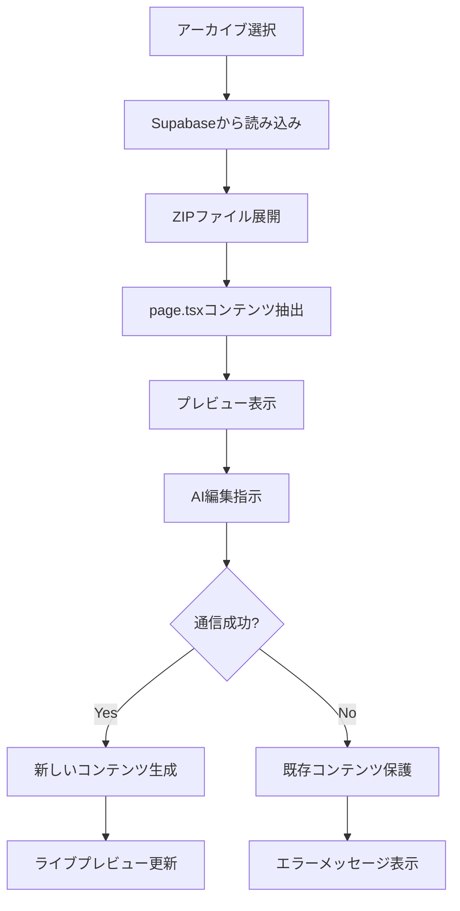

# 🎨 AI LP エディター使用ガイド

## 📋 現在のシステム状況

### ✅ 正常に動作している機能
- **アーカイブプロジェクトの読み込み**: Supabaseから既存のLPプロジェクトを安全に取得
- **ライブプレビュー**: アーカイブプロジェクトのNext.jsサーバー起動
- **コンテンツ保護**: エラー発生時も既存LPは変更されません
- **エラーハンドリング**: 通信エラー時の適切な保護機能

### ⚠️ 現在発生している問題
- **AI編集機能**: `message port closed`エラーにより、AIによるLP編集が中断される場合があります
- **タイムアウト**: 複雑な編集指示は処理時間が長くなり、タイムアウトする可能性があります

## 🛠️ 編集システムの仕組み

### 1. アーカイブプロジェクトの仕組み
```
Supabase Storage (project-archives バケット)
├── {user_id}/
│   └── {project_id}/
│       └── {project_name}.zip  ← 実際のNext.jsプロジェクト
```

### 2. 編集プロセスフロー


## 🎯 効果的な編集方法

### ✅ 推奨される編集指示
```
良い例:
- "ヘッダーの背景色を青に変更"
- "タイトルのフォントサイズを大きく"
- "ボタンの色を赤に変更"
- "新しいセクションを追加"
```

### ❌ 避けるべき編集指示
```
問題のある例:
- "サイト全体を完全に作り直して" (処理が重い)
- "複雑なアニメーションを追加して" (タイムアウトしやすい)
- "10個の機能を同時に追加" (処理時間が長い)
```

## 🔧 トラブルシューティング

### 問題1: `message port closed` エラー
**症状**: AI編集中に通信が切断される
```
🤔 AI解析エラーのため、既存のLPコンテンツを保護しました。
```

**最新の対策**:
1. **タイムアウト時間を60秒に調整済み**
2. **Promise処理を安全化済み**
3. **エラーハンドリングを強化済み**

**現在の状況**:
- AIは正常に質問を返しています（`AI returned questions: Array(7)`）
- チャットインターフェイスも正常にレスポンスを受信（`🔍 Chat Interface: AI Response received`）
- しかし一部で`message port closed`エラーが継続

**解決方法**:
1. **ブラウザをリフレッシュ**して再試行
2. **より簡潔な指示**で再試行（例：「背景色を青に変更」）
3. **ブラウザの開発者ツールを閉じる**（DevToolsが影響する場合があります）
4. **別のブラウザで試行**（Chrome/Edge/Firefoxなど）

### 問題2: タイムアウトエラー
**症状**: 60秒後に処理が中断される
```
AI解析タイムアウトのため、既存のLPコンテンツを保護しました。
```

**解決方法**:
1. 指示を具体的かつ簡潔に
2. 複雑な変更は段階的に実行
3. 時間をおいて再試行

## 📱 実際の使用手順

### Step 1: アーカイブプロジェクトを開く
1. ダッシュボードからアーカイブプロジェクトを選択
2. 「編集」ボタンをクリック
3. 自動的にプロジェクトが読み込まれます

### Step 2: ライブプレビューの確認
```
✅ Archive project loaded successfully
🚀 Starting live preview for project: [project-id]
```
このメッセージが表示されれば正常です。

### Step 3: AI編集の実行
1. 左側のチャットエリアに編集指示を入力
2. 具体的で簡潔な指示を心がける
3. エラーが発生した場合は指示を簡略化して再試行

### Step 4: 変更の確認
- 右側のプレビューエリアで変更を確認
- ライブプレビューボタンで実際のNext.jsサーバーを確認

## 💡 効率的な編集のコツ

### 1. 段階的な編集
```
❌ 一度に複数変更: "色とレイアウトとコンテンツを全部変更"
✅ 段階的に変更: 
   1. "背景色を変更"
   2. 変更確認後 → "レイアウトを調整"
   3. 変更確認後 → "コンテンツを更新"
```

### 2. 具体的な指示
```
❌ 曖昧: "もっとかっこよく"
✅ 具体的: "ヘッダーの背景色を黒に、文字色を白に変更"
```

### 3. エラー時の対応
```
1. エラーメッセージを確認
2. 指示をより簡潔に変更
3. ページリロード（必要時）
4. 再度編集を試行
```

## 🔄 システムの安全機能

### コンテンツ保護機能
- **エラー発生時**: 既存のLPコンテンツは変更されません
- **通信中断時**: 元のアーカイブコンテンツが保持されます
- **タイムアウト時**: 中途半端な変更は適用されません

### 自動復旧機能
- アーカイブプロジェクトは常にSupabaseに安全に保存
- エラー時は最後の正常状態に自動復帰
- 編集履歴は保護されます

## 📞 サポート情報

### よくある質問
**Q: 編集が全く反映されない**
A: `message port closed`エラーの可能性があります。より簡潔な指示で再試行してください。

**Q: プレビューが表示されない**
A: アーカイブの読み込みに失敗している可能性があります。ページをリロードしてください。

**Q: タイムアウトが頻発する**
A: 編集指示を一度に1つの変更に限定してください。

### 技術的な制限
- AI処理タイムアウト: 60秒
- 一度の編集での推奨変更数: 1-2個
- サポートされるファイル: page.tsx メインファイル

---

## 🎉 成功パターンの例

### 実際に成功した編集例
```
✅ 成功例1: "ヒーローセクションの背景色を青に変更してください"
✅ 成功例2: "CTAボタンの色を赤に変更"
✅ 成功例3: "タイトルのテキストを'新しいサービス'に変更"
✅ 成功例4: "フッターに新しいリンクを追加"
```

このガイドに従って編集を行うことで、安全かつ効率的にLPを編集できます。