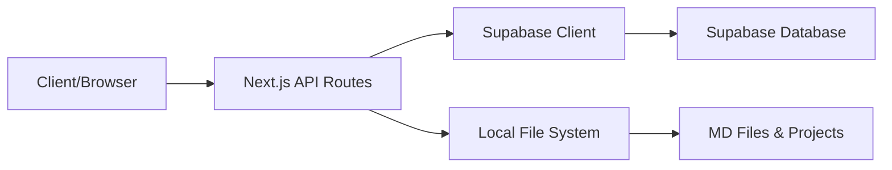
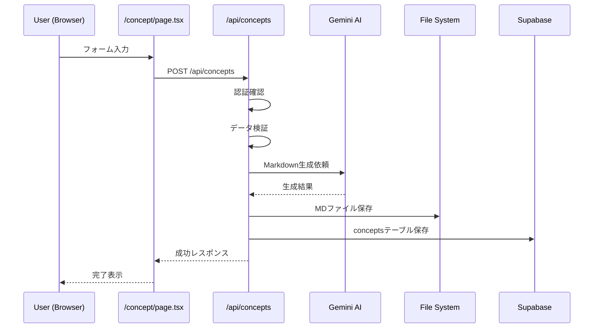
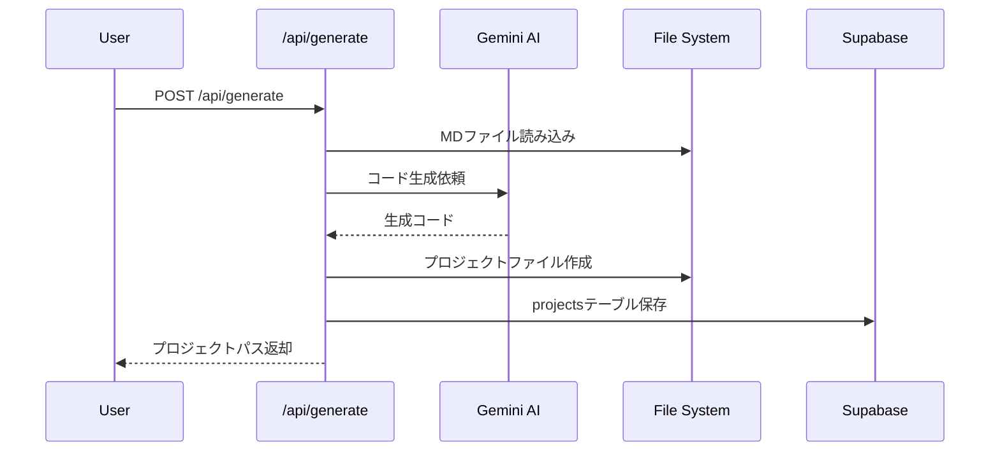

# 📊 Supabase接続・保存ロジック アーキテクチャドキュメント

## 🏗️ システムアーキテクチャ概要



## 📁 主要ファイル構成と役割

### 1. Supabase接続設定

#### `/ai-lp-generator/src/lib/supabase-server.ts`
**役割**: サーバーサイドでのSupabase認証付きクライアント生成

```typescript
export async function createServerSupabaseClient() {
  const cookieStore = cookies()
  return createServerClient(
    process.env.NEXT_PUBLIC_SUPABASE_URL!,
    process.env.NEXT_PUBLIC_SUPABASE_ANON_KEY!,
    { cookies: { get(name) { return cookieStore.get(name)?.value } } }
  )
}
```

**使用場所**: 
- 全APIルート (`/api/concepts`, `/api/projects`, `/api/generate`)
- サーバーサイドでの認証が必要な処理

#### `/ai-lp-generator/src/lib/supabase-browser.ts`
**役割**: クライアントサイドでのSupabase接続

```typescript
export function createBrowserSupabaseClient() {
  return createBrowserClient(
    process.env.NEXT_PUBLIC_SUPABASE_URL!,
    process.env.NEXT_PUBLIC_SUPABASE_ANON_KEY!
  )
}
```

**使用場所**:
- React components
- `/lib/auth-context.tsx` (認証コンテキスト)
- クライアントサイドでのデータ取得

### 2. コンセプト保存フロー

#### `/ai-lp-generator/src/app/api/concepts/route.ts`

**主要処理フロー** (147-393行):

1. **認証確認** (153-184行)
```typescript
const supabase = await createServerSupabaseClient()
const { data: { user }, error: authError } = await supabase.auth.getUser()
if (!user) return NextResponse.json({ error: '認証が必要です' }, { status: 401 })
```

2. **データ検証** (206-224行)
```typescript
const validation = validatePasonaStructure(body)
if (!validation.isValid) {
  return NextResponse.json({ 
    error: 'データ検証に失敗しました',
    validationErrors: validation.errors 
  }, { status: 400 })
}
```

3. **Markdown生成** (244-270行)
```typescript
// Gemini AI による生成を試行
markdown = await generateMarkdownWithGemini(conceptParams, params.brief)
// 失敗時はフォールバック
markdown = buildMarkdown(conceptParams)
```

4. **ローカルファイル保存** (273-291行)
```typescript
fileResult = await saveConceptMarkdown({ ...conceptParams, markdown })
// 保存先: /concepts/[siteName]-[timestamp].md
```

5. **Supabaseデータベース保存** (293-366行)
```typescript
const { data: conceptData, error: insertError } = await supabase
  .from('concepts')
  .insert({
    site_name: params.siteName,
    pasona_input: {
      problem: params.problem,
      affinity: params.affinity,
      solution: params.solution,
      offer: params.offer,
      narrowing_down: params.narrowingDown,
      action: params.action
    },
    markdown_content: markdown,
    brief: params.brief,
    colors: params.colors,
    nav: params.nav,
    logo_text: params.logoText,
    socials: params.socials,
    contact: params.contact,
    file_path: fileResult.filePathRelative,
    user_id: user.id
  })
  .select()
  .single()
```

### 3. Markdown生成・保存ロジック

#### `/ai-lp-generator/src/lib/generator/concept.ts`

**主要関数**:

##### `generateMarkdownWithGemini()` (約50-150行)
```typescript
export async function generateMarkdownWithGemini(
  params: ConceptParams, 
  brief?: string
): Promise<string> {
  const genAI = new GoogleGenerativeAI(API_KEY)
  const model = genAI.getGenerativeModel({ model: "gemini-1.5-pro" })
  
  const prompt = `
    以下の情報を基に、Next.js LPのためのMarkdownドキュメントを生成してください。
    ${JSON.stringify(params)}
  `
  
  const result = await model.generateContent(prompt)
  return result.response.text()
}
```

##### `buildMarkdown()` (約200-300行)
```typescript
export function buildMarkdown(params: ConceptParams): string {
  // テンプレートベースのMarkdown生成
  return `
# ${params.siteName}

## 概要
${params.brief || ''}

## PASONA Framework

### Problem (問題)
${params.problem}

### Affinity (親近感)
${params.affinity}

### Solution (解決策)
${params.solution}

### Offer (提案)
${params.offer}

### Narrowing Down (絞り込み)
${params.narrowingDown}

### Action (行動)
${params.action}

## デザイン設定
- Primary: ${params.colors.primary}
- Accent: ${params.colors.accent}
- Background: ${params.colors.background}
  `
}
```

##### `saveConceptMarkdown()` (約350-400行)
```typescript
export async function saveConceptMarkdown(
  params: ConceptParams & { markdown: string }
): Promise<SaveResult> {
  const timestamp = new Date().toISOString().replace(/[:.]/g, '-')
  const fileName = `${params.siteName}-${timestamp}.md`
  const filePath = path.join(CONCEPTS_DIR, fileName)
  
  // ディレクトリ作成
  await fs.mkdir(CONCEPTS_DIR, { recursive: true })
  
  // ファイル書き込み
  await fs.writeFile(filePath, params.markdown, 'utf-8')
  
  return {
    fileName,
    filePath,
    filePathRelative: path.relative(process.cwd(), filePath)
  }
}
```

### 4. プロジェクト生成フロー

#### `/ai-lp-generator/src/app/api/generate/route.ts`

**主要処理フロー**:

1. **認証確認**
```typescript
const supabase = await createServerSupabaseClient()
const { data: { user } } = await supabase.auth.getUser()
```

2. **MDファイル読み込み**
```typescript
const mdPath = path.join(process.cwd(), file)
const conceptData = await fs.readFile(mdPath, 'utf-8')
```

3. **AI生成 or テンプレート生成**
```typescript
if (useCliMode) {
  // CLI生成モード
  await generateProjectViaCLI(name, mdPath)
} else {
  // API生成モード
  const code = await generateWithGemini(conceptData)
}
```

4. **プロジェクトファイル作成**
```typescript
const projectPath = path.join(PROJECTS_DIR, projectName)
await createProjectFiles(projectPath, generatedFiles)
```

5. **Supabase projects テーブル保存**
```typescript
const { data: project } = await supabase
  .from('projects')
  .insert({
    name,
    concept_file: mdPath,
    project_path: projectPath,
    archive_url: archiveUrl,
    user_id: user.id
  })
  .select()
  .single()
```

### 5. データベーススキーマ

#### `/ai-lp-generator/EMERGENCY_CONCEPTS_TABLE.sql`
```sql
-- Concepts テーブル定義
CREATE TABLE public.concepts (
  id uuid DEFAULT gen_random_uuid() PRIMARY KEY,
  user_id uuid REFERENCES auth.users(id) NOT NULL,
  site_name text NOT NULL,
  markdown_content text NOT NULL,
  
  -- PASONA Framework fields
  pasona_input jsonb DEFAULT '{}'::jsonb,
  brief text,
  
  -- Design fields
  colors jsonb DEFAULT '{}'::jsonb,
  nav jsonb DEFAULT '[]'::jsonb,
  logo_text text,
  socials jsonb DEFAULT '{}'::jsonb,
  contact jsonb DEFAULT '{}'::jsonb,
  
  -- File path
  file_path text,
  
  -- Timestamps
  created_at timestamptz DEFAULT now(),
  updated_at timestamptz DEFAULT now()
);

-- インデックス
CREATE INDEX idx_concepts_user_id ON public.concepts(user_id);
CREATE INDEX idx_concepts_created_at ON public.concepts(created_at DESC);
CREATE INDEX idx_concepts_site_name ON public.concepts(site_name);

-- RLS (Row Level Security)
ALTER TABLE public.concepts ENABLE ROW LEVEL SECURITY;

CREATE POLICY "Users can view own concepts" ON public.concepts
  FOR SELECT USING (auth.uid() = user_id);

CREATE POLICY "Users can insert own concepts" ON public.concepts
  FOR INSERT WITH CHECK (auth.uid() = user_id);

CREATE POLICY "Users can update own concepts" ON public.concepts
  FOR UPDATE USING (auth.uid() = user_id);

CREATE POLICY "Users can delete own concepts" ON public.concepts
  FOR DELETE USING (auth.uid() = user_id);
```

#### `/ai-lp-generator/supabase-projects-table.sql`
```sql
-- Projects テーブル定義
CREATE TABLE public.projects (
  id uuid DEFAULT gen_random_uuid() PRIMARY KEY,
  user_id uuid REFERENCES auth.users(id) NOT NULL,
  name text NOT NULL,
  concept_file text,
  project_path text,
  archive_url text,
  status text DEFAULT 'generated',
  metadata jsonb DEFAULT '{}'::jsonb,
  created_at timestamptz DEFAULT now(),
  updated_at timestamptz DEFAULT now()
);

-- インデックスとRLS
CREATE INDEX idx_projects_user_id ON public.projects(user_id);
CREATE INDEX idx_projects_created_at ON public.projects(created_at DESC);

ALTER TABLE public.projects ENABLE ROW LEVEL SECURITY;

CREATE POLICY "Users can manage own projects" ON public.projects
  FOR ALL USING (auth.uid() = user_id);
```

## 🔍 データフロー詳細

### コンセプト作成フロー


### プロジェクト生成フロー


## ⚠️ セキュリティ考慮事項

### 1. 認証・認可
- **全APIルート**: `supabase.auth.getUser()` による認証チェック
- **RLS (Row Level Security)**: 各テーブルで `auth.uid() = user_id` ポリシー適用
- **クッキーベース認証**: サーバーサイドでのセキュアな認証状態管理

### 2. 環境変数管理
```env
# .env.local
NEXT_PUBLIC_SUPABASE_URL=https://xxx.supabase.co
NEXT_PUBLIC_SUPABASE_ANON_KEY=eyJxxx...
SUPABASE_SERVICE_ROLE_KEY=eyJxxx... # サーバーのみ
GEMINI_API_KEY=AIzaSyxxx...
```

### 3. データアクセス制御
- ユーザーは自分のデータのみアクセス可能
- サービスロールキーはサーバーサイドのみで使用
- クライアントサイドは anon key のみ使用

## 📊 改善提案

### 1. トランザクション処理
```typescript
// 現状: 個別処理
await saveConceptMarkdown(params)  // ローカル保存
await supabase.from('concepts').insert(...)  // DB保存

// 改善案: トランザクション化
await supabase.rpc('save_concept_with_file', {
  concept_data: params,
  file_path: filePath
})
```

### 2. エラーハンドリング強化
```typescript
// retryOperation の活用拡大
const conceptData = await retryOperation(
  () => supabase.from('concepts').insert(...),
  3,  // maxRetries
  1000  // delay
)
```

### 3. キャッシュ戦略
```typescript
// React Query or SWR 導入
const { data: concepts } = useSWR(
  '/api/concepts',
  fetcher,
  { revalidateOnFocus: false }
)
```

### 4. バックアップ戦略
- MDファイルを Supabase Storage にバックアップ
- 定期的なデータベースバックアップ
- プロジェクトアーカイブのクラウド保存

## 📚 関連ドキュメント

- [Supabase公式ドキュメント](https://supabase.com/docs)
- [Next.js App Router](https://nextjs.org/docs/app)
- [Gemini AI API](https://ai.google.dev/docs)

---

*最終更新: 2025-08-13*
*作成者: PRESIDENT - AI Development Organization*