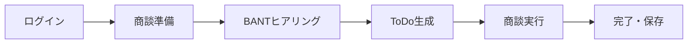

# AI商談支援アプリ - 統合要件仕様書

## 📋 文書情報

| 項目 | 内容 |
|------|------|
| **プロジェクト名** | AI Sales Assistant - 商談成約率向上支援システム |
| **文書種別** | 統合要件仕様書 |
| **作成日** | 2025年1月8日 |
| **作成者** | Worker1（機能要件・UI/UX要件担当） |
| **承認者** | Boss1, President |
| **バージョン** | 1.0 |
| **関連文書** | functional-requirements.md, ui-ux-requirements.md, user-stories.md, nextjs-architecture.md, interaction-flow-design.md |

## 1. エグゼクティブサマリー

### 1.1 プロジェクト概要
本プロジェクトは、営業担当者の商談成約率向上を目的としたAI支援Webアプリケーションの開発です。BANT条件（Budget, Authority, Need, Timeline）に基づく体系的ヒアリング、AI自動ToDoリスト生成、リアルタイム音声解析による商談進捗管理を主要機能とし、Next.js 15とGoogle Gemini APIを核心技術として採用します。

### 1.2 ビジネス価値
- **営業効率化**: 商談準備時間50%削減
- **成約率向上**: BANT条件漏れなしで20%成約率向上
- **標準化**: 営業プロセスの統一と品質向上
- **データドリブン**: 音声解析による客観的な商談評価

### 1.3 技術スタック
- **フロントエンド**: Next.js 15 (App Router), React 19, Tailwind CSS
- **バックエンド**: Supabase (認証・データベース), Next.js API Routes
- **AI機能**: Google Gemini 1.5 Flash API
- **音声認識**: Web Speech API
- **デプロイ**: Vercel (予定)

## 2. 機能要件（Functional Requirements）

### 2.1 核心機能

#### F001: BANTヒアリング機能 【優先度: High】
**概要**: AIチャットボットによる段階的な顧客ヒアリング機能

**詳細要件**:
- Budget（予算）: 投資規模、承認プロセス、ROI期待値の聴取
- Authority（決裁権）: 意思決定者、承認フロー、関係者の特定  
- Need（ニーズ）: 現状課題、解決緊急度、理想状態の明確化
- Timeline（導入時期）: 導入スケジュール、理由、準備期間の確認

**技術要件**:
- Google Gemini API統合による適応的質問生成
- セッション管理とデータ永続化
- フォールバック機能（API障害時のデフォルト質問）
- リアルタイム進捗表示

**Acceptance Criteria**:
- [ ] 4段階のBANT条件を順次ヒアリング
- [ ] 各段階で2-3個の動的質問生成
- [ ] 回答に応じた追加質問の自動生成
- [ ] 進捗状況の視覚化（プログレスバー）
- [ ] セッション中断・復帰機能

#### F002: AI ToDoリスト生成機能 【優先度: High】
**概要**: BANTヒアリング結果に基づくカスタマイズされた商談タスク生成

**詳細要件**:
- アイスブレイク、ヒアリング、提案、クロージングの4カテゴリ分類
- 顧客情報に基づいた個別最適化
- タスクの編集・追加・削除機能
- 進捗可視化とカテゴリ別統計

**技術要件**:
- Gemini API による自然言語処理
- Supabaseデータベース連携
- リアルタイム進捗計算
- JSON形式でのデータ交換

**Acceptance Criteria**:
- [ ] BANTデータから5-8個の具体的タスク生成
- [ ] 4カテゴリへの自動分類
- [ ] インライン編集機能
- [ ] 完了率とカテゴリ別進捗の表示
- [ ] カスタムタスク追加機能

#### F003: リアルタイム音声解析機能 【優先度: High】
**概要**: Web Speech APIによる音声認識とToDo完了自動判定

**詳細要件**:
- 30秒間隔での音声バッファリング処理
- 音声テキスト化とToDoタスクの意味的類似度計算
- 類似度閾値による自動完了判定
- 手動修正・取り消し機能

**技術要件**:
- Web Speech API（webkitSpeechRecognition）
- Gemini API による意味的類似度計算
- リアルタイム処理とバッファ管理
- 多言語対応（日本語、英語）

**Acceptance Criteria**:
- [ ] 音声のリアルタイム認識
- [ ] 30秒バッファでの処理最適化
- [ ] 類似度スコア0.1-1.0での完了判定
- [ ] 感度調整機能（ユーザー設定）
- [ ] 音声フィードバック機能

#### F004: 商談ダッシュボード機能 【優先度: Medium】
**概要**: リアルタイム進捗モニタリングと分析機能

**詳細要件**:
- 全体進捗率とカテゴリ別完了状況表示
- タスク完了速度とパフォーマンス指標
- 予想終了時刻と効率スコア算出
- 音声認識履歴と統計情報

**Acceptance Criteria**:
- [ ] 円形プログレスバーでの進捗表示
- [ ] 完了タスク数/総タスク数表示
- [ ] 平均完了時間と完了速度計算
- [ ] 予想終了時刻の動的算出
- [ ] 音声認識履歴の保存・表示

### 2.2 支援機能

#### F005: 認証・ユーザー管理 【優先度: High】
- Supabase Auth統合
- メール認証とパスワード管理
- セッション管理と自動ログアウト
- プロフィール設定機能

#### F006: プロジェクト管理 【優先度: Medium】
- 商談プロジェクトの作成・保存
- 過去セッションの履歴表示
- プロジェクト検索・フィルタリング
- データエクスポート機能

#### F007: 設定管理 【優先度: Medium】
- 音声認識設定（言語、感度調整）
- UI設定（テーマ、通知）
- ユーザープリファレンス保存
- デフォルト値リセット機能

## 3. UI/UX要件（User Experience Requirements）

### 3.1 デザインシステム

#### 3.1.1 視覚的階層
```css
/* カラーパレット */
Primary: #3B82F6 (Blue), #6366F1 (Indigo), #8B5CF6 (Purple)
Secondary: #10B981 (Green), #F59E0B (Yellow), #EF4444 (Red)
Neutral: #F9FAFB to #111827 (Gray Scale)

/* タイポグラフィ */
Font Family: Inter, Noto Sans JP
Font Sizes: 12px-30px (8段階)
Font Weights: 400, 500, 600, 700

/* レイアウト */
Spacing: 4px-32px (Powers of 2)
Border Radius: 6px-16px
Shadows: 3段階（sm, md, lg）
```

#### 3.1.2 コンポーネント設計原則
- **Atomic Design**: 原子→分子→有機体→テンプレート→ページ
- **Consistent**: 一貫したデザインパターン
- **Responsive**: モバイルファースト設計
- **Accessible**: WCAG 2.1 AA準拠

### 3.2 ユーザーインターフェース要件

#### 3.2.1 レイアウト構造
```
Header (80px固定)
├── Logo + Title
├── Progress Steps
└── User Menu

Main Content (可変高)
├── Step 1: Chat Interface (600px)
├── Step 2: Todo + BANT Summary (Grid 2:1)
└── Step 3: Dashboard + Audio Control (Grid 3:1:2)

Footer (Optional)
└── App Info + Links
```

#### 3.2.2 レスポンシブブレークポイント
- **Mobile**: < 768px (シングルカラム)
- **Tablet**: 768px - 1024px (フレキシブルグリッド)
- **Desktop**: > 1024px (フルレイアウト)

### 3.3 インタラクション設計

#### 3.3.1 マイクロインタラクション
- **ボタンクリック**: 0.2秒スケールダウン→バウンス
- **完了通知**: チェックマーク出現 + グリーンパルス
- **ローディング**: スケルトンUI + 3点アニメーション
- **エラー表示**: 赤シェイク + アイコン表示

#### 3.3.2 ナビゲーションフロー


### 3.4 アクセシビリティ要件

#### 3.4.1 WCAG 2.1準拠
- **知覚可能**: カラーコントラスト比4.5:1以上
- **操作可能**: キーボードナビゲーション対応
- **理解可能**: 明確なラベルとヘルプテキスト
- **堅牢**: スクリーンリーダー対応

#### 3.4.2 インクルーシブデザイン
- 色覚多様性対応（色以外の手がかり併用）
- 運動能力配慮（44px以上のタッチターゲット）
- 認知負荷軽減（段階的な情報開示）

## 4. 技術要件（Technical Requirements）

### 4.1 システムアーキテクチャ

#### 4.1.1 フロントエンド技術
- **Next.js 15**: App Router使用、SSR/SSG最適化
- **React 19**: 最新機能活用、パフォーマンス重視
- **TypeScript**: 型安全性とコード品質向上
- **Tailwind CSS**: ユーティリティファースト設計

#### 4.1.2 バックエンド技術
- **Supabase**: 認証、データベース、リアルタイム機能
- **PostgreSQL**: RLSによるセキュアなデータ管理
- **Next.js API Routes**: サーバーレス機能
- **Vercel**: エッジ最適化デプロイメント

#### 4.1.3 外部API統合
- **Google Gemini 1.5 Flash**: 高速AI推論
- **Web Speech API**: ブラウザネイティブ音声認識
- **Supabase Auth**: OAuth、メール認証
- **Vercel Analytics**: パフォーマンス監視

### 4.2 データベース設計

#### 4.2.1 テーブル構造
```sql
-- 商談プロジェクト管理
CREATE TABLE meeting_projects (
    id UUID PRIMARY KEY DEFAULT gen_random_uuid(),
    user_id UUID REFERENCES auth.users(id) NOT NULL,
    title VARCHAR(255) NOT NULL,
    client_name VARCHAR(255),
    status VARCHAR(50) DEFAULT 'preparation',
    -- BANT情報
    budget TEXT,
    authority TEXT,
    need TEXT,
    timeline TEXT,
    created_at TIMESTAMPTZ DEFAULT NOW(),
    updated_at TIMESTAMPTZ DEFAULT NOW()
);

-- ToDoアイテム管理
CREATE TABLE todo_items (
    id UUID PRIMARY KEY DEFAULT gen_random_uuid(),
    project_id UUID REFERENCES meeting_projects(id) NOT NULL,
    task_text TEXT NOT NULL,
    category VARCHAR(50) CHECK (category IN 
        ('アイスブレイク', 'ヒアリング', '提案', 'クロージング')),
    order_index INTEGER DEFAULT 0,
    completed BOOLEAN DEFAULT FALSE,
    similarity_threshold DECIMAL(3,2) DEFAULT 0.7,
    detected_speech TEXT,
    created_at TIMESTAMPTZ DEFAULT NOW()
);

-- 音声認識記録
CREATE TABLE speech_records (
    id UUID PRIMARY KEY DEFAULT gen_random_uuid(),
    project_id UUID REFERENCES meeting_projects(id) NOT NULL,
    transcribed_text TEXT NOT NULL,
    confidence_score DECIMAL(3,2),
    processing_duration INTEGER,
    created_at TIMESTAMPTZ DEFAULT NOW()
);

-- ユーザー設定
CREATE TABLE user_settings (
    id UUID PRIMARY KEY DEFAULT gen_random_uuid(),
    user_id UUID REFERENCES auth.users(id) UNIQUE NOT NULL,
    default_similarity_threshold DECIMAL(3,2) DEFAULT 0.7,
    speech_language VARCHAR(10) DEFAULT 'ja-JP',
    theme VARCHAR(20) DEFAULT 'light',
    email_notifications BOOLEAN DEFAULT TRUE,
    created_at TIMESTAMPTZ DEFAULT NOW()
);
```

#### 4.2.2 セキュリティ（RLS）
```sql
-- Row Level Security有効化
ALTER TABLE meeting_projects ENABLE ROW LEVEL SECURITY;
ALTER TABLE todo_items ENABLE ROW LEVEL SECURITY;
ALTER TABLE speech_records ENABLE ROW LEVEL SECURITY;
ALTER TABLE user_settings ENABLE ROW LEVEL SECURITY;

-- ポリシー設定（ユーザーは自分のデータのみアクセス可能）
CREATE POLICY "Users manage own projects" ON meeting_projects
    FOR ALL USING (auth.uid() = user_id);
```

### 4.3 API設計

#### 4.3.1 RESTful API仕様
```javascript
// BANT チャット
POST /api/chat
{
  "message": "予算は月額10万円程度です",
  "stage": "budget",
  "projectId": "uuid"
}

// ToDo 管理
POST /api/todos
{
  "projectId": "uuid", 
  "bantAnswers": {...}
}

PATCH /api/todos/:id
{
  "completed": true,
  "detectedSpeech": "予算について確認しました"
}

// 音声処理
POST /api/speech/analyze
{
  "transcript": "予算の件でご質問があります",
  "todos": [...]
}
```

#### 4.3.2 エラーハンドリング
```javascript
// 統一エラーレスポンス形式
{
  "error": true,
  "code": "GEMINI_API_ERROR",
  "message": "AI機能が一時的に利用できません",
  "fallback": {
    "questions": ["デフォルト質問"],
    "todos": ["基本タスク"]
  }
}
```

## 5. パフォーマンス要件（Performance Requirements）

### 5.1 レスポンス時間要件
| 操作 | 目標時間 | 許容時間 |
|------|----------|----------|
| ページ初期読み込み | 2秒以下 | 3秒以下 |
| AIチャット応答 | 2秒以下 | 5秒以下 |
| ToDo生成 | 3秒以下 | 7秒以下 |
| 音声認識処理 | 1秒以下 | 2秒以下 |
| データベース操作 | 500ms以下 | 1秒以下 |

### 5.2 スケーラビリティ要件
- **同時ユーザー**: 100人以上
- **データ容量**: プロジェクト10,000件以上
- **API呼び出し**: 毎分100リクエスト以上
- **音声処理**: 並行10セッション以上

### 5.3 可用性・信頼性
- **稼働率**: 99.5%以上（月間約3.6時間のダウンタイム）
- **データバックアップ**: 自動バックアップ（24時間毎）
- **障害復旧**: 平均復旧時間30分以内
- **データ整合性**: ACID準拠のトランザクション

## 6. セキュリティ要件（Security Requirements）

### 6.1 認証・認可
- **多要素認証**: メール認証必須
- **セッション管理**: JWT トークンベース
- **パスワード**: 8文字以上、複雑性要件
- **自動ログアウト**: 24時間非活性で自動実行

### 6.2 データ保護
- **暗号化**: 保存時・転送時データ暗号化
- **個人情報**: GDPR・個人情報保護法準拠
- **API キー**: 環境変数での安全管理
- **監査ログ**: セキュリティイベント記録

### 6.3 アプリケーションセキュリティ
- **入力検証**: XSS、SQLインジェクション対策
- **CORS**: オリジン制限設定
- **CSP**: Content Security Policy設定
- **HTTPS**: 全通信SSL/TLS暗号化

## 7. 非機能要件（Non-Functional Requirements）

### 7.1 ユーザビリティ
- **学習時間**: 新規ユーザー5分以内で基本操作習得
- **タスク完了率**: 95%以上
- **エラー発生率**: 5%以下
- **ユーザー満足度**: SUS スコア80点以上

### 7.2 互換性
- **ブラウザ**: Chrome 90+, Firefox 85+, Safari 14+, Edge 90+
- **OS**: Windows 10+, macOS 11+, iOS 14+, Android 10+
- **解像度**: 320px〜4K対応
- **デバイス**: スマートフォン、タブレット、PC

### 7.3 保守性・拡張性
- **コードカバレッジ**: 80%以上
- **技術債務**: SonarQube評価A以上  
- **モジュール結合度**: 低結合・高凝集設計
- **API バージョニング**: セマンティックバージョニング

## 8. プロジェクト制約・前提条件

### 8.1 技術的制約
- **API制限**: Gemini API の利用制限（RPM, TPM）
- **ブラウザ機能**: Web Speech API対応ブラウザ必須
- **ネットワーク**: インターネット接続必須
- **権限**: マイクアクセス許可必要

### 8.2 ビジネス制約
- **予算**: 開発・運用コスト最適化
- **スケジュール**: MVP 4週間以内リリース
- **法的要件**: 個人情報保護法、GDPR準拠
- **業界規制**: 営業データ管理規制対応

### 8.3 運用制約
- **メンテナンス**: 週次定期メンテナンス
- **サポート**: 営業時間内サポート対応
- **監視**: 24時間システム監視
- **災害復旧**: RPO 4時間、RTO 2時間

## 9. 受入基準（Acceptance Criteria）

### 9.1 機能受入基準
- [ ] BANTヒアリングの4段階完了機能
- [ ] AIによるカスタマイズToDo生成機能
- [ ] 音声認識による自動進捗更新機能
- [ ] リアルタイムダッシュボード表示機能
- [ ] プロジェクト保存・復元機能

### 9.2 性能受入基準
- [ ] ページ読み込み2秒以内達成
- [ ] AI応答3秒以内達成
- [ ] 音声処理1秒以内達成
- [ ] 同時100ユーザー処理可能
- [ ] 99.5%稼働率達成

### 9.3 品質受入基準
- [ ] ユニットテストカバレッジ80%以上
- [ ] E2E テスト主要フロー100%通過
- [ ] アクセシビリティWCAG 2.1 AA準拠
- [ ] セキュリティ脆弱性ゼロ
- [ ] パフォーマンステストクリア

## 10. リスク管理

### 10.1 技術リスク
| リスク | 影響度 | 発生確率 | 対策 |
|--------|--------|----------|------|
| Gemini API制限 | 高 | 中 | フォールバック機能、キャッシュ最適化 |
| 音声認識精度 | 中 | 高 | 手動補正、感度調整機能 |
| ブラウザ互換性 | 中 | 低 | プログレッシブ対応、ポリフィル |

### 10.2 ビジネスリスク
| リスク | 影響度 | 発生確率 | 対策 |
|--------|--------|----------|------|
| 競合他社参入 | 高 | 中 | 差別化機能強化、特許出願検討 |
| ユーザー受容性 | 中 | 中 | MVP早期リリース、フィードバック反映 |
| データ規制変更 | 中 | 低 | 法務確認、プライバシー対応強化 |

## 11. 成功指標（KPI）

### 11.1 ビジネスKPI
- **MAU**: 月間アクティブユーザー500人以上
- **利用継続率**: 3ヶ月継続率70%以上
- **商談成約率**: 前年比20%向上
- **準備時間短縮**: 50%短縮達成

### 11.2 技術KPI
- **アップタイム**: 99.5%以上維持
- **レスポンス時間**: 平均2秒以下維持
- **エラー率**: 1%以下維持
- **ユーザー満足度**: NPS +50以上

---

## 12. 付録

### 12.1 関連文書
- [機能要件詳細](./functional-requirements.md)
- [UI/UX要件詳細](./ui-ux-requirements.md)  
- [ユーザーストーリー](./user-stories.md)
- [Next.jsアーキテクチャ](./nextjs-architecture.md)
- [インタラクションフロー](./interaction-flow-design.md)

### 12.2 用語集
| 用語 | 定義 |
|------|------|
| **BANT** | Budget, Authority, Need, Timelineの営業手法 |
| **MVP** | Minimum Viable Product（実用最小限の製品） |
| **RLS** | Row Level Security（行レベルセキュリティ） |
| **PWA** | Progressive Web App（プログレッシブウェブアプリ） |

### 12.3 承認履歴
| 日付 | 承認者 | バージョン | 備考 |
|------|--------|------------|------|
| 2025-01-08 | Worker1 | 1.0 | 初版作成完了 |
| - | Boss1 | - | 承認待ち |
| - | President | - | 最終承認待ち |

---

**本文書は AI商談支援アプリ開発プロジェクトの包括的要件仕様書として、全ステークホルダーの合意形成と開発指針の提供を目的とします。**