# AI商談支援アプリ - インタラクションフロー設計書

## 1. 全体フロー概要

### 1.1 メインユーザージャーニー
```
[ログイン] → [商談準備開始] → [BANTヒアリング] → [ToDo生成] → [商談実行] → [完了・保存]
    ↓              ↓              ↓              ↓            ↓
認証フロー    初期設定フロー   チャットフロー   編集フロー   音声解析フロー
```

### 1.2 システム状態遷移
```
初期状態 (Initial)
    ↓
認証完了 (Authenticated) 
    ↓
商談準備 (Preparation)
    ↓
BANT実行 (BANTInProgress) 
    ↓
ToDo生成 (TodoGeneration)
    ↓
商談実行 (MeetingInProgress)
    ↓
完了状態 (Completed)
```

## 2. 詳細インタラクションフロー

### 2.1 認証・ログインフロー

#### 2.1.1 初回訪問時
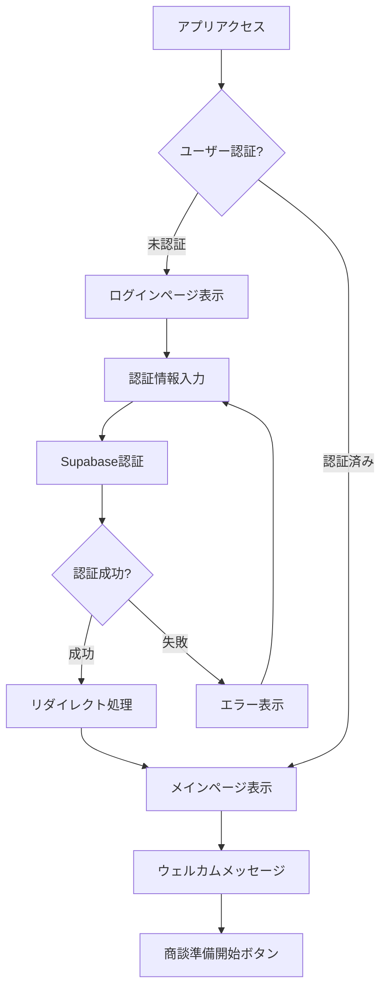

#### 2.1.2 ユーザーアクション
- **入力フィールド**: メールアドレス、パスワード
- **フィードバック**: 入力検証（リアルタイム）、ローディング状態
- **エラーハンドリング**: 無効な認証情報、ネットワークエラー
- **成功時動作**: スムーズなページ遷移、状態復元

### 2.2 BANTヒアリングフロー

#### 2.2.1 チャット初期化
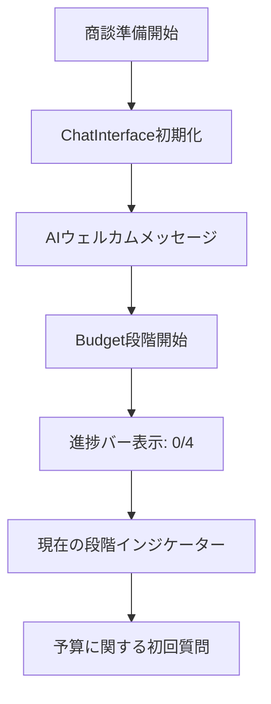

#### 2.2.2 段階別インタラクション

**Budget段階のフロー:**
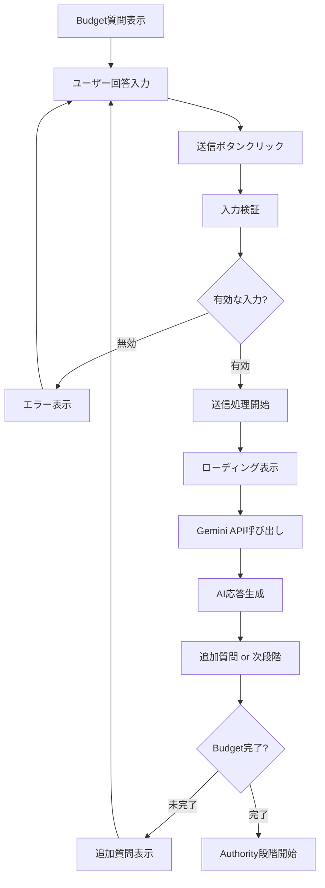

#### 2.2.3 段階間遷移
- **視覚的フィードバック**: 進捗サークルの色変更（グレー→ブルー→グリーン）
- **アニメーション**: スムーズなトランジション（0.3秒）
- **状態保存**: 各段階の回答データ永続化
- **戻り機能**: 前の段階への戻り（編集可能）

### 2.3 ToDo生成・編集フロー

#### 2.3.1 自動生成プロセス
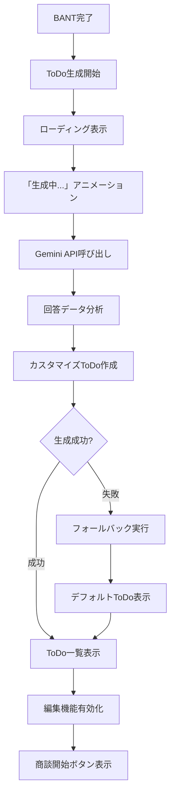

#### 2.3.2 ToDoアイテム操作
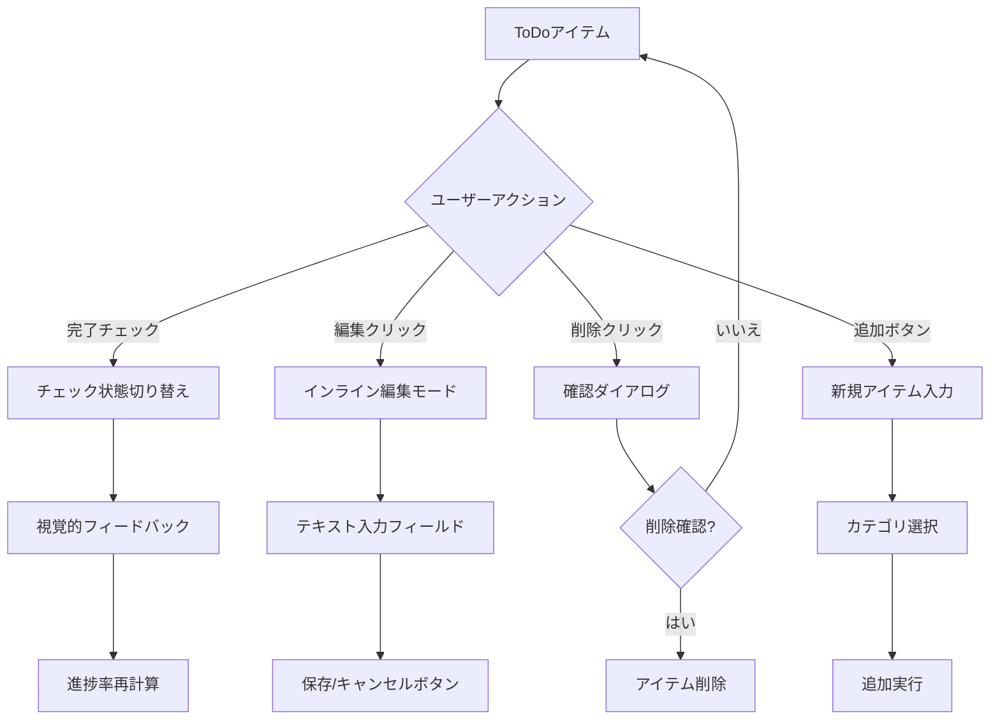

#### 2.3.3 視覚的フィードバック
- **完了状態**: グリーンハイライト + チェックアイコン
- **編集状態**: フォーカスアウトライン + 編集コントロール
- **ホバー効果**: 微細な影・スケール変化
- **進捗更新**: プログレスバーのスムーズなアニメーション

### 2.4 音声解析・商談実行フロー

#### 2.4.1 商談開始プロセス
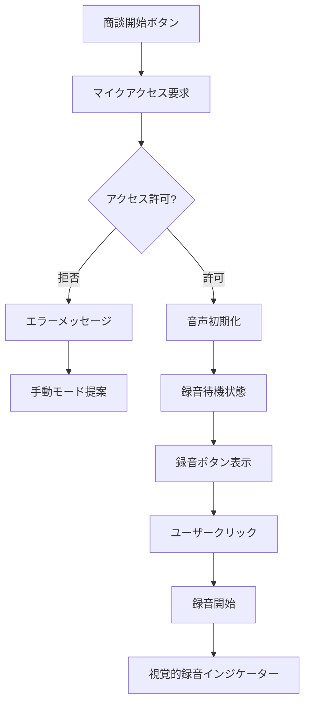

#### 2.4.2 リアルタイム音声処理
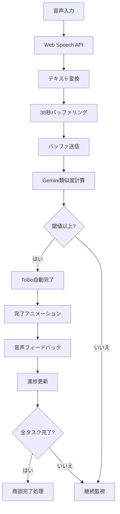

#### 2.4.3 音声制御インタラクション
- **録音開始**: 大きな録音ボタン（緑→赤）、パルスアニメーション
- **録音中**: 時間表示、音声波形（オプション）、停止ボタン
- **処理中**: スピナー + 「解析中...」テキスト
- **完了検知**: 成功アニメーション + 音声通知

### 2.5 エラーハンドリングフロー

#### 2.5.1 API障害対応
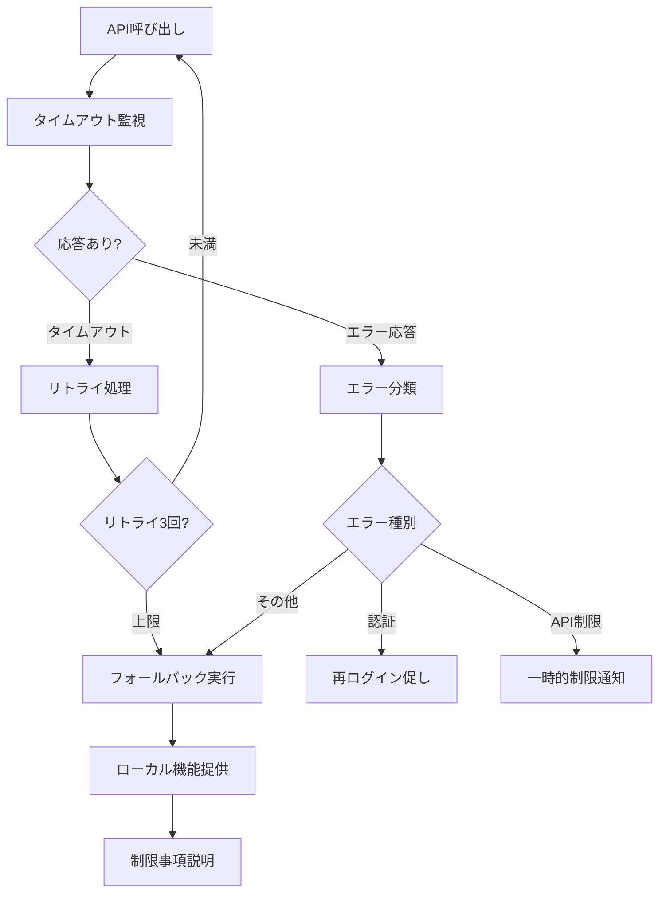

#### 2.5.2 ユーザー体験保持
- **グレースフルデグラデーション**: 核心機能は維持
- **明確なエラーメッセージ**: 原因と対処法を説明
- **代替手段提供**: 手動操作による継続
- **状態復元**: エラー解決後の自動復帰

### 2.6 設定・カスタマイゼーションフロー

#### 2.6.1 音声設定調整
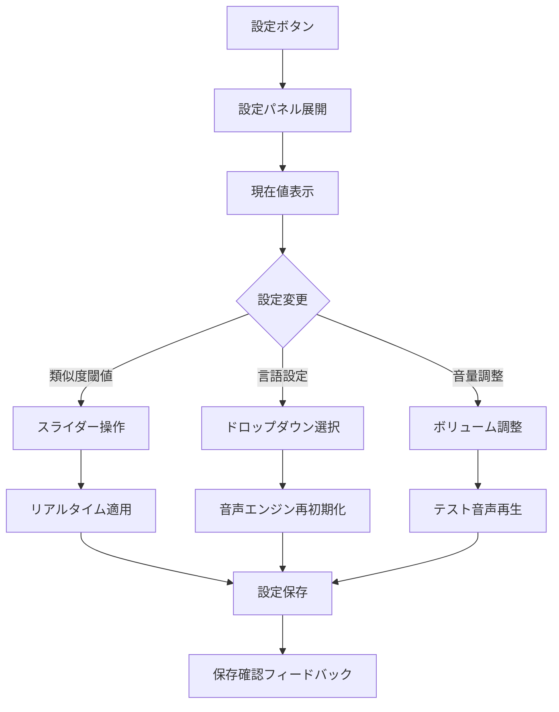

#### 2.6.2 インタラクティブ調整
- **即座の反映**: 設定変更の即時適用
- **プレビュー機能**: 変更結果の事前確認
- **リセット機能**: デフォルト値への復元
- **設定説明**: ツールチップによるヘルプ

### 2.7 データ保存・復元フロー

#### 2.7.1 自動保存プロセス
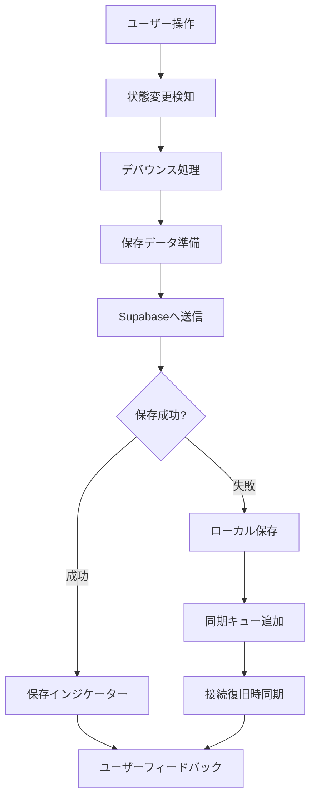

#### 2.7.2 セッション管理
- **自動保存**: 操作から2秒後に自動実行
- **オフライン対応**: ローカルストレージにバックアップ
- **同期機能**: オンライン復帰時の自動同期
- **履歴管理**: 商談セッション履歴の保存

## 3. レスポンシブインタラクション

### 3.1 デバイス別最適化

#### 3.1.1 モバイル（スマートフォン）
- **タッチ操作**: 44px以上のタッチターゲット
- **スワイプ**: 段階間のスワイプナビゲーション
- **音声入力**: 大きな音声ボタン、長押し録音
- **画面遷移**: フルスクリーンモーダル使用

#### 3.1.2 タブレット
- **ハイブリッド操作**: タッチ + 一部マウス操作
- **分割画面**: チャットとToDo同時表示
- **ドラッグ&ドロップ**: ToDo並び替え機能
- **ピンチズーム**: ダッシュボード拡大縮小

#### 3.1.3 デスクトップ
- **キーボードショートカット**: Ctrl+S（保存）、Enter（送信）
- **ホバー効果**: リッチなマウスオーバーフィードバック
- **複数ウィンドウ**: サブウィンドウでの詳細表示
- **右クリックメニュー**: コンテキストメニュー

### 3.2 アクセシビリティインタラクション

#### 3.2.1 キーボード操作
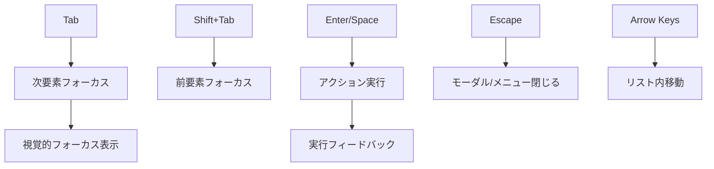

#### 3.2.2 スクリーンリーダー対応
- **ARIA属性**: role, aria-label, aria-describedby
- **構造化マークアップ**: 見出し階層、ランドマーク
- **動的コンテンツ通知**: aria-live regions
- **フォーカス管理**: 論理的なフォーカス順序

## 4. パフォーマンス最適化

### 4.1 レンダリング最適化
- **仮想化**: 長いToDoリストの仮想スクロール
- **遅延読み込み**: 画面外コンポーネントの遅延マウント
- **メモ化**: React.memo による再レンダリング抑制
- **バンドル分割**: ルート別コード分割

### 4.2 インタラクション応答性
- **デバウンス**: 連続操作の制限（300ms）
- **スロットリング**: 音声処理の頻度制限
- **プリロード**: 次画面リソースの先読み
- **キャッシュ**: API応答のクライアントキャッシュ

## 5. 状態管理パターン

### 5.1 クライアント状態
```javascript
// 状態管理構造
const AppState = {
  // 認証状態
  auth: {
    user: null,
    loading: false,
    error: null
  },
  
  // 商談フロー状態
  meeting: {
    currentStep: 'chat', // 'chat' | 'todo' | 'meeting'
    projectId: null,
    bantAnswers: {},
    todos: [],
    progress: 0
  },
  
  // 音声機能状態
  audio: {
    isRecording: false,
    transcript: '',
    isProcessing: false,
    settings: {
      language: 'ja-JP',
      threshold: 0.7,
      volume: 1.0
    }
  },
  
  // UI状態
  ui: {
    sidebarOpen: false,
    settingsOpen: false,
    loading: {},
    errors: {}
  }
}
```

### 5.2 状態更新パターン
```javascript
// Reducer パターン例
function meetingReducer(state, action) {
  switch (action.type) {
    case 'CHAT_COMPLETE':
      return {
        ...state,
        currentStep: 'todo',
        bantAnswers: action.payload.answers,
        projectId: action.payload.projectId
      }
      
    case 'TODO_UPDATE':
      return {
        ...state,
        todos: state.todos.map(todo =>
          todo.id === action.payload.id
            ? { ...todo, ...action.payload.updates }
            : todo
        )
      }
      
    case 'AUDIO_START':
      return {
        ...state,
        audio: {
          ...state.audio,
          isRecording: true,
          transcript: ''
        }
      }
      
    default:
      return state
  }
}
```

---

**文書作成日**: 2025年1月8日  
**作成者**: Worker1  
**承認者**: Boss1, President  
**バージョン**: 1.0