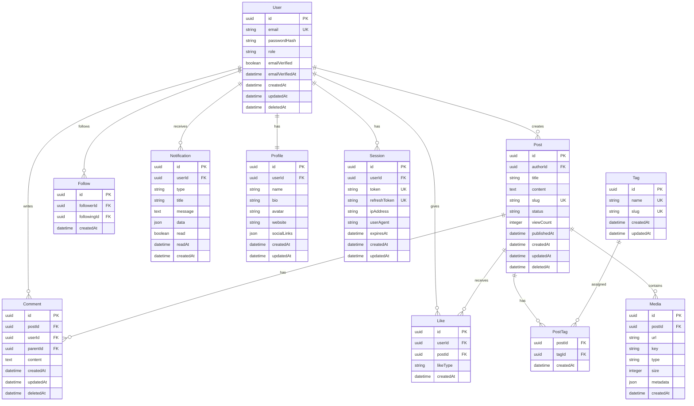

# データベース設計書

## 1. データベース概要

### 1.1 基本情報
- **DBMS**: PostgreSQL 15.x (本番環境)
- **開発環境**: SQLite / PostgreSQL (Docker)
- **ORM**: Prisma 5.x
- **マイグレーション**: Prisma Migrate
- **接続プール**: PgBouncer (本番環境)

### 1.2 設計方針
- 正規化レベル: 第3正規形を基本とする
- インデックス戦略: 検索頻度の高いカラムに適切に配置
- ソフトデリート採用: deletedAtカラムによる論理削除
- タイムスタンプ: createdAt/updatedAtを全テーブルに配置
- UUID採用: プライマリキーにUUIDv4を使用

## 2. ER図



## 3. テーブル定義

### 3.1 Usersテーブル
```sql
CREATE TABLE users (
    id UUID PRIMARY KEY DEFAULT gen_random_uuid(),
    email VARCHAR(255) UNIQUE NOT NULL,
    password_hash VARCHAR(255) NOT NULL,
    role VARCHAR(50) DEFAULT 'user',
    email_verified BOOLEAN DEFAULT false,
    email_verified_at TIMESTAMP,
    created_at TIMESTAMP DEFAULT CURRENT_TIMESTAMP,
    updated_at TIMESTAMP DEFAULT CURRENT_TIMESTAMP,
    deleted_at TIMESTAMP,
    
    INDEX idx_users_email (email),
    INDEX idx_users_role (role),
    INDEX idx_users_deleted_at (deleted_at)
);
```

### 3.2 Profilesテーブル
```sql
CREATE TABLE profiles (
    id UUID PRIMARY KEY DEFAULT gen_random_uuid(),
    user_id UUID NOT NULL REFERENCES users(id) ON DELETE CASCADE,
    name VARCHAR(100),
    bio TEXT,
    avatar VARCHAR(500),
    website VARCHAR(255),
    social_links JSONB,
    created_at TIMESTAMP DEFAULT CURRENT_TIMESTAMP,
    updated_at TIMESTAMP DEFAULT CURRENT_TIMESTAMP,
    
    UNIQUE(user_id),
    INDEX idx_profiles_user_id (user_id)
);
```

### 3.3 Postsテーブル
```sql
CREATE TABLE posts (
    id UUID PRIMARY KEY DEFAULT gen_random_uuid(),
    author_id UUID NOT NULL REFERENCES users(id) ON DELETE CASCADE,
    title VARCHAR(255) NOT NULL,
    content TEXT NOT NULL,
    slug VARCHAR(255) UNIQUE NOT NULL,
    status VARCHAR(20) DEFAULT 'draft',
    view_count INTEGER DEFAULT 0,
    published_at TIMESTAMP,
    created_at TIMESTAMP DEFAULT CURRENT_TIMESTAMP,
    updated_at TIMESTAMP DEFAULT CURRENT_TIMESTAMP,
    deleted_at TIMESTAMP,
    
    INDEX idx_posts_author_id (author_id),
    INDEX idx_posts_slug (slug),
    INDEX idx_posts_status (status),
    INDEX idx_posts_published_at (published_at),
    INDEX idx_posts_deleted_at (deleted_at),
    FULLTEXT INDEX idx_posts_fulltext (title, content)
);
```

### 3.4 Commentsテーブル
```sql
CREATE TABLE comments (
    id UUID PRIMARY KEY DEFAULT gen_random_uuid(),
    post_id UUID NOT NULL REFERENCES posts(id) ON DELETE CASCADE,
    user_id UUID NOT NULL REFERENCES users(id) ON DELETE CASCADE,
    parent_id UUID REFERENCES comments(id) ON DELETE CASCADE,
    content TEXT NOT NULL,
    created_at TIMESTAMP DEFAULT CURRENT_TIMESTAMP,
    updated_at TIMESTAMP DEFAULT CURRENT_TIMESTAMP,
    deleted_at TIMESTAMP,
    
    INDEX idx_comments_post_id (post_id),
    INDEX idx_comments_user_id (user_id),
    INDEX idx_comments_parent_id (parent_id),
    INDEX idx_comments_deleted_at (deleted_at)
);
```

### 3.5 Likesテーブル
```sql
CREATE TABLE likes (
    id UUID PRIMARY KEY DEFAULT gen_random_uuid(),
    user_id UUID NOT NULL REFERENCES users(id) ON DELETE CASCADE,
    post_id UUID NOT NULL REFERENCES posts(id) ON DELETE CASCADE,
    like_type VARCHAR(20) DEFAULT 'like',
    created_at TIMESTAMP DEFAULT CURRENT_TIMESTAMP,
    
    UNIQUE(user_id, post_id),
    INDEX idx_likes_post_id (post_id),
    INDEX idx_likes_user_id (user_id)
);
```

### 3.6 Tagsテーブル
```sql
CREATE TABLE tags (
    id UUID PRIMARY KEY DEFAULT gen_random_uuid(),
    name VARCHAR(50) UNIQUE NOT NULL,
    slug VARCHAR(50) UNIQUE NOT NULL,
    created_at TIMESTAMP DEFAULT CURRENT_TIMESTAMP,
    updated_at TIMESTAMP DEFAULT CURRENT_TIMESTAMP,
    
    INDEX idx_tags_name (name),
    INDEX idx_tags_slug (slug)
);
```

### 3.7 PostTagsテーブル
```sql
CREATE TABLE post_tags (
    post_id UUID NOT NULL REFERENCES posts(id) ON DELETE CASCADE,
    tag_id UUID NOT NULL REFERENCES tags(id) ON DELETE CASCADE,
    created_at TIMESTAMP DEFAULT CURRENT_TIMESTAMP,
    
    PRIMARY KEY (post_id, tag_id),
    INDEX idx_post_tags_tag_id (tag_id)
);
```

### 3.8 Followsテーブル
```sql
CREATE TABLE follows (
    id UUID PRIMARY KEY DEFAULT gen_random_uuid(),
    follower_id UUID NOT NULL REFERENCES users(id) ON DELETE CASCADE,
    following_id UUID NOT NULL REFERENCES users(id) ON DELETE CASCADE,
    created_at TIMESTAMP DEFAULT CURRENT_TIMESTAMP,
    
    UNIQUE(follower_id, following_id),
    INDEX idx_follows_follower_id (follower_id),
    INDEX idx_follows_following_id (following_id),
    CHECK (follower_id != following_id)
);
```

### 3.9 Mediaテーブル
```sql
CREATE TABLE media (
    id UUID PRIMARY KEY DEFAULT gen_random_uuid(),
    post_id UUID REFERENCES posts(id) ON DELETE CASCADE,
    url VARCHAR(500) NOT NULL,
    key VARCHAR(255) UNIQUE NOT NULL,
    type VARCHAR(50) NOT NULL,
    size INTEGER NOT NULL,
    metadata JSONB,
    created_at TIMESTAMP DEFAULT CURRENT_TIMESTAMP,
    
    INDEX idx_media_post_id (post_id),
    INDEX idx_media_type (type)
);
```

### 3.10 Notificationsテーブル
```sql
CREATE TABLE notifications (
    id UUID PRIMARY KEY DEFAULT gen_random_uuid(),
    user_id UUID NOT NULL REFERENCES users(id) ON DELETE CASCADE,
    type VARCHAR(50) NOT NULL,
    title VARCHAR(255) NOT NULL,
    message TEXT NOT NULL,
    data JSONB,
    read BOOLEAN DEFAULT false,
    read_at TIMESTAMP,
    created_at TIMESTAMP DEFAULT CURRENT_TIMESTAMP,
    
    INDEX idx_notifications_user_id (user_id),
    INDEX idx_notifications_read (read),
    INDEX idx_notifications_created_at (created_at)
);
```

### 3.11 Sessionsテーブル
```sql
CREATE TABLE sessions (
    id UUID PRIMARY KEY DEFAULT gen_random_uuid(),
    user_id UUID NOT NULL REFERENCES users(id) ON DELETE CASCADE,
    token VARCHAR(500) UNIQUE NOT NULL,
    refresh_token VARCHAR(500) UNIQUE NOT NULL,
    ip_address INET,
    user_agent TEXT,
    expires_at TIMESTAMP NOT NULL,
    created_at TIMESTAMP DEFAULT CURRENT_TIMESTAMP,
    updated_at TIMESTAMP DEFAULT CURRENT_TIMESTAMP,
    
    INDEX idx_sessions_user_id (user_id),
    INDEX idx_sessions_token (token),
    INDEX idx_sessions_refresh_token (refresh_token),
    INDEX idx_sessions_expires_at (expires_at)
);
```

## 4. Prismaスキーマ定義

```prisma
// prisma/schema.prisma

generator client {
  provider = "prisma-client-js"
}

datasource db {
  provider = "postgresql"
  url      = env("DATABASE_URL")
}

model User {
  id              String    @id @default(uuid())
  email           String    @unique
  passwordHash    String    @map("password_hash")
  role            String    @default("user")
  emailVerified   Boolean   @default(false) @map("email_verified")
  emailVerifiedAt DateTime? @map("email_verified_at")
  createdAt       DateTime  @default(now()) @map("created_at")
  updatedAt       DateTime  @updatedAt @map("updated_at")
  deletedAt       DateTime? @map("deleted_at")
  
  profile       Profile?
  posts         Post[]
  comments      Comment[]
  likes         Like[]
  followers     Follow[]  @relation("follower")
  following     Follow[]  @relation("following")
  notifications Notification[]
  sessions      Session[]
  
  @@index([email])
  @@index([role])
  @@index([deletedAt])
  @@map("users")
}

model Profile {
  id          String   @id @default(uuid())
  userId      String   @unique @map("user_id")
  name        String?
  bio         String?
  avatar      String?
  website     String?
  socialLinks Json?    @map("social_links")
  createdAt   DateTime @default(now()) @map("created_at")
  updatedAt   DateTime @updatedAt @map("updated_at")
  
  user User @relation(fields: [userId], references: [id], onDelete: Cascade)
  
  @@index([userId])
  @@map("profiles")
}

model Post {
  id          String    @id @default(uuid())
  authorId    String    @map("author_id")
  title       String
  content     String
  slug        String    @unique
  status      String    @default("draft")
  viewCount   Int       @default(0) @map("view_count")
  publishedAt DateTime? @map("published_at")
  createdAt   DateTime  @default(now()) @map("created_at")
  updatedAt   DateTime  @updatedAt @map("updated_at")
  deletedAt   DateTime? @map("deleted_at")
  
  author   User      @relation(fields: [authorId], references: [id], onDelete: Cascade)
  comments Comment[]
  likes    Like[]
  tags     PostTag[]
  media    Media[]
  
  @@index([authorId])
  @@index([slug])
  @@index([status])
  @@index([publishedAt])
  @@index([deletedAt])
  @@map("posts")
}

model Comment {
  id        String    @id @default(uuid())
  postId    String    @map("post_id")
  userId    String    @map("user_id")
  parentId  String?   @map("parent_id")
  content   String
  createdAt DateTime  @default(now()) @map("created_at")
  updatedAt DateTime  @updatedAt @map("updated_at")
  deletedAt DateTime? @map("deleted_at")
  
  post     Post      @relation(fields: [postId], references: [id], onDelete: Cascade)
  user     User      @relation(fields: [userId], references: [id], onDelete: Cascade)
  parent   Comment?  @relation("CommentReplies", fields: [parentId], references: [id], onDelete: Cascade)
  replies  Comment[] @relation("CommentReplies")
  
  @@index([postId])
  @@index([userId])
  @@index([parentId])
  @@index([deletedAt])
  @@map("comments")
}

model Like {
  id        String   @id @default(uuid())
  userId    String   @map("user_id")
  postId    String   @map("post_id")
  likeType  String   @default("like") @map("like_type")
  createdAt DateTime @default(now()) @map("created_at")
  
  user User @relation(fields: [userId], references: [id], onDelete: Cascade)
  post Post @relation(fields: [postId], references: [id], onDelete: Cascade)
  
  @@unique([userId, postId])
  @@index([postId])
  @@index([userId])
  @@map("likes")
}

model Tag {
  id        String    @id @default(uuid())
  name      String    @unique
  slug      String    @unique
  createdAt DateTime  @default(now()) @map("created_at")
  updatedAt DateTime  @updatedAt @map("updated_at")
  
  posts PostTag[]
  
  @@index([name])
  @@index([slug])
  @@map("tags")
}

model PostTag {
  postId    String   @map("post_id")
  tagId     String   @map("tag_id")
  createdAt DateTime @default(now()) @map("created_at")
  
  post Post @relation(fields: [postId], references: [id], onDelete: Cascade)
  tag  Tag  @relation(fields: [tagId], references: [id], onDelete: Cascade)
  
  @@id([postId, tagId])
  @@index([tagId])
  @@map("post_tags")
}

model Follow {
  id          String   @id @default(uuid())
  followerId  String   @map("follower_id")
  followingId String   @map("following_id")
  createdAt   DateTime @default(now()) @map("created_at")
  
  follower  User @relation("follower", fields: [followerId], references: [id], onDelete: Cascade)
  following User @relation("following", fields: [followingId], references: [id], onDelete: Cascade)
  
  @@unique([followerId, followingId])
  @@index([followerId])
  @@index([followingId])
  @@map("follows")
}

model Media {
  id        String   @id @default(uuid())
  postId    String?  @map("post_id")
  url       String
  key       String   @unique
  type      String
  size      Int
  metadata  Json?
  createdAt DateTime @default(now()) @map("created_at")
  
  post Post? @relation(fields: [postId], references: [id], onDelete: Cascade)
  
  @@index([postId])
  @@index([type])
  @@map("media")
}

model Notification {
  id        String    @id @default(uuid())
  userId    String    @map("user_id")
  type      String
  title     String
  message   String
  data      Json?
  read      Boolean   @default(false)
  readAt    DateTime? @map("read_at")
  createdAt DateTime  @default(now()) @map("created_at")
  
  user User @relation(fields: [userId], references: [id], onDelete: Cascade)
  
  @@index([userId])
  @@index([read])
  @@index([createdAt])
  @@map("notifications")
}

model Session {
  id           String   @id @default(uuid())
  userId       String   @map("user_id")
  token        String   @unique
  refreshToken String   @unique @map("refresh_token")
  ipAddress    String?  @map("ip_address")
  userAgent    String?  @map("user_agent")
  expiresAt    DateTime @map("expires_at")
  createdAt    DateTime @default(now()) @map("created_at")
  updatedAt    DateTime @updatedAt @map("updated_at")
  
  user User @relation(fields: [userId], references: [id], onDelete: Cascade)
  
  @@index([userId])
  @@index([token])
  @@index([refreshToken])
  @@index([expiresAt])
  @@map("sessions")
}
```

## 5. インデックス戦略

### 5.1 主要インデックス
- 主キー: 全テーブルのid列に自動作成
- 外部キー: リレーション列に自動作成
- ユニークキー: email, slug, token等に作成
- 複合インデックス: 頻繁に組み合わせて検索される列

### 5.2 パフォーマンスチューニング
```sql
-- 投稿の全文検索用インデックス
CREATE INDEX idx_posts_fulltext ON posts USING gin(to_tsvector('english', title || ' ' || content));

-- 時系列データ用インデックス
CREATE INDEX idx_posts_created_at_desc ON posts(created_at DESC);

-- 統計情報の更新
ANALYZE posts;
ANALYZE users;
```

## 6. マイグレーション戦略

### 6.1 初期マイグレーション
```bash
# Prismaマイグレーション作成
npx prisma migrate dev --name init

# 本番環境へのデプロイ
npx prisma migrate deploy
```

### 6.2 バックアップ戦略
- 日次バックアップ: 全データベース
- 週次バックアップ: 完全バックアップ
- トランザクションログ: リアルタイムレプリケーション

## 7. セキュリティ対策

### 7.1 アクセス制御
- Row Level Security (RLS)の実装
- 最小権限の原則に基づく権限設定
- 接続の暗号化 (SSL/TLS)

### 7.2 データ保護
- パスワードのハッシュ化 (bcrypt)
- 個人情報の暗号化
- SQLインジェクション対策 (Prepared Statements)